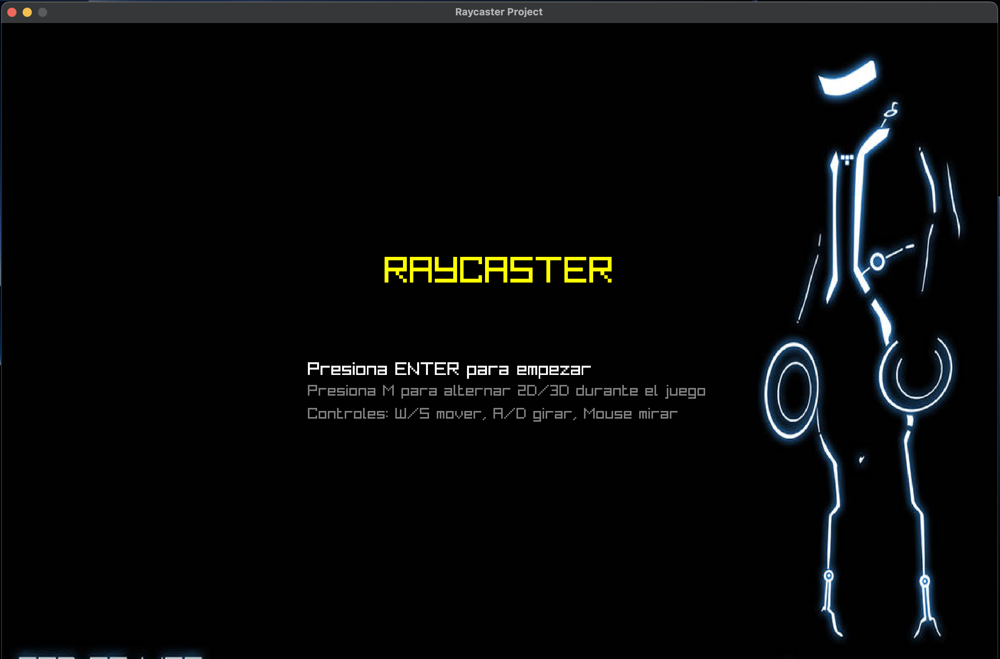
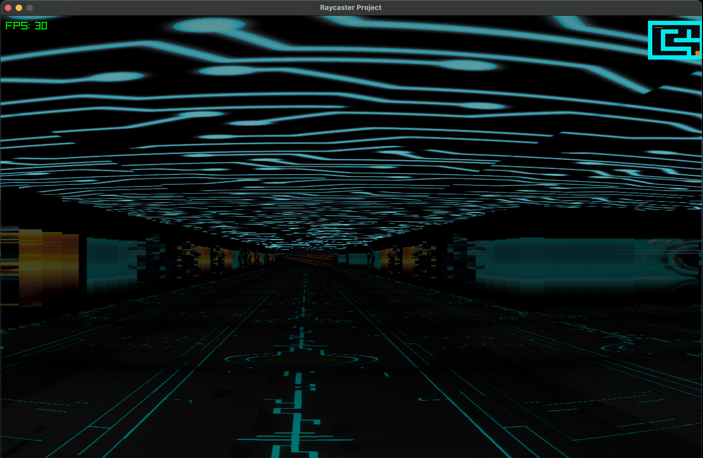
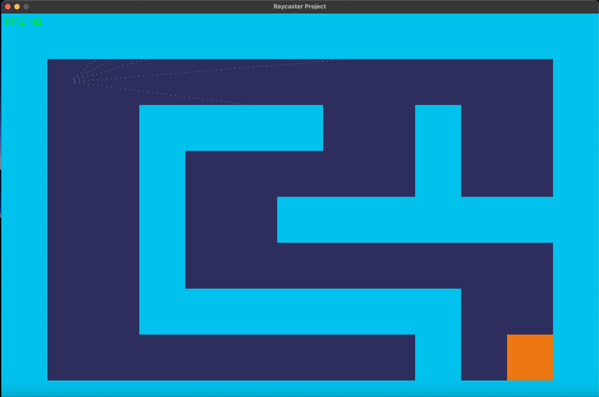

# 🌌 **Raycasting Project - TRON Edition**

Welcome to the Raycasting project inspired by the visual universe of **TRON**. This game lets you explore mazes in first person, switching between 2D and 3D views, with neon visual effects and immersive music.

---

## 🚀 **How to Run the Project**

1. **Install Rust**  
   If you don't have Rust, install it from [rustup.rs](https://rustup.rs/).

2. **Clone the repository**  
   ```bash
   git clone https://github.com/your-username/raycasting-tron.git
   cd raycasting-tron
   ```

3. **Download dependencies**  
   ```bash
   cargo build
   ```

4. **Run the game**  
   ```bash
   cargo run
   ```

---

## 🎮 **Controls**

- **W/S**: Move forward/backward
- **A/D**: Turn left/right
- **Mouse**: Look around
- **M**: Toggle between 2D and 3D view
- **ENTER**: Select/continue
- **ESC**: Return to menu

---

## 🏁 **Features**

- **Real-time raycasting** to render 3D mazes.
- **Interactive minimap** in 3D view.
- **Custom textures** for walls, floor, and sky.
- **TRON-inspired music and sound effects.**
- **Level selection** from the main menu.
- **Neon-style animations and visual effects.**

---

## 📁 **Project Structure**

```
Proyecto-Raycasting/
├── src/
│   ├── main.rs
│   ├── maze.rs
│   ├── player.rs
│   └── ...
├── assets/
│   ├── textures/
│   ├── music/
│   └── sfx/
├── README.md
└── ...
```

---

## ✨ **Screenshots**

<p align="center">
  
  
  
  
</p>

---

## 💡 **Credits**

- **Developer:** Nicolás Concuá
- **Universidad del Valle de Guatemala**
- **Course:** Computer Graphics

---

## 🛠️ **Technologies**

- [Rust](https://www.rust-lang.org/)
- [Raylib-rs](https://github.com/deltaphc/raylib-rs)

---

## 📬 **Contact**

Questions or suggestions?  
Write to: [nicoconcua@gmail.com](mailto:nicoconcua@gmail.com)

---

<p align="center">
  <b>Enjoy the TRON experience and challenge the mazes!</b>
</p>
